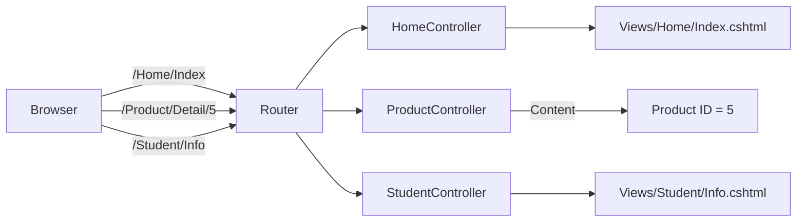

# StudentManagement — Walkthrough (ASP.NET Lesson 2)

This project implements **Bài 1**, **Bài 2**, and **Bài 3** from *ASP. Net - Lesson 2 - Practice.doc* using **ASP.NET Core MVC** (.NET 10). Classic “ASP.NET MVC” on .NET Framework is no longer the default stack; Core MVC is the modern equivalent and satisfies the same concepts (Controller, Action, Routing, ViewBag, ViewData, Model).

---

## Prerequisites

- [.NET SDK](https://dotnet.microsoft.com/download) (8.x or 10.x)
- Optional: Visual Studio 2022 / VS Code with C# extension

Verify:

```powershell
dotnet --version
```

---

## Project structure

```
StudentManagement/
├── Controllers/
│   ├── HomeController.cs      # Bài 1
│   ├── ProductController.cs   # Bài 2
│   └── StudentController.cs   # Bài 3
├── Models/
│   └── StudentMajorViewModel.cs
├── Views/
│   ├── Home/    (Index, About, Contact)
│   ├── Student/ (Info)
│   └── Shared/  (_Layout.cshtml)
└── Program.cs                 # Routing configuration
```

---

## Run the application

```powershell
cd "f:\code\Learning\C#\StudentManagement"
dotnet run
```

Open the URL shown in the console (e.g. `http://localhost:5xxx`) or use:

```powershell
dotnet run --urls "http://localhost:5180"
```

Then browse to `http://localhost:5180`.

---

## Bài 1 — Tạo Controller (HomeController)

### Requirement

| Action  | Display content              |
|---------|------------------------------|
| Index   | Welcome to ASP.NET MVC         |
| About   | Student name                 |
| Contact | Student email                |

### How it works

1. **URL pattern** (default route in `Program.cs`):

   `{controller}/{action}/{id?}`

2. **`/Home/Index`** → `HomeController.Index()` → `Views/Home/Index.cshtml`

3. **About** and **Contact** pass data via `ViewData` and render in their views.

### Try it

| URL            | Expected result                          |
|----------------|------------------------------------------|
| `/Home/Index`  | Heading: **Welcome to ASP.NET MVC**      |
| `/Home/About`  | **Nguyễn Văn A**                       |
| `/Home/Contact`| **nguyenvana@student.edu.vn**          |

### Key concepts

- **Controller**: class that handles HTTP requests (`HomeController`).
- **Action**: public method that returns a result (`Index`, `About`, `Contact`).
- **Routing**: maps URL segments to controller + action.

---

## Bài 2 — Routing và tham số (ProductController)

### Requirement

| Action   | Parameter | Example URL                         | Output              |
|----------|-----------|-------------------------------------|---------------------|
| Detail   | `id`      | `/Product/Detail/5`                 | Product ID = 5      |
| Category | `name`    | `/Product/Category?name=Laptop`     | Category = Laptop   |

**Nâng cao**: missing parameters → error message.

### How it works

- **Route parameter**: `id` is the third URL segment → bound to `Detail(int? id)`.
- **Query string**: `name` in `?name=Laptop` → bound to `Category(string? name)`.
- **Validation**: if `id` or `name` is missing, the action returns plain-text error (UTF-8).

### Try it

```text
/Product/Detail/5
/Product/Category?name=Laptop
/Product/Detail          → error message
/Product/Category        → error message
```

### Key concepts

- **Convention-based routing**: `Product` → `ProductController`, `Detail` → `Detail()`.
- **Model binding**: ASP.NET Core fills action parameters from route and query string.

---

## Bài 3 — Truyền dữ liệu sang View (StudentController)

### Requirement

| Data  | Mechanism  | Value        |
|-------|------------|--------------|
| Name  | ViewBag    | Nguyễn Văn A |
| Age   | ViewData   | 20           |
| Major | Model      | CNTT         |

View output:

```text
Tên: Nguyễn Văn A
Tuổi: 20
Ngành: CNTT
```

### How it works

1. `StudentController.Info()` sets `ViewBag.Name` and `ViewData["Age"]`.
2. It creates `StudentMajorViewModel` with `Major = "CNTT"` and passes it to the view as **Model**.
3. `Views/Student/Info.cshtml` reads all three sources.

### Try it

Open: **`/Student/Info`**

### Key concepts

- **ViewBag**: dynamic dictionary (`ViewBag.Name`).
- **ViewData**: string-keyed dictionary (`ViewData["Age"]`).
- **Model**: strongly typed object (`@model StudentMajorViewModel`, `@Model.Major`).

---

## Routing diagram



---

## Files to review (in order)

1. `Program.cs` — default route
2. `Controllers/HomeController.cs`
3. `Controllers/ProductController.cs`
4. `Controllers/StudentController.cs`
5. `Views/Student/Info.cshtml`
6. `Models/StudentMajorViewModel.cs`

---

## Homework checklist

- [x] Project name: **StudentManagement**
- [x] **HomeController**: Index, About, Contact
- [x] **ProductController**: Detail, Category + error when params missing
- [x] **StudentController**: Info with ViewBag, ViewData, Model
- [x] Build succeeds: `dotnet build`

---

## Troubleshooting

| Issue | Fix |
|-------|-----|
| Port already in use | `dotnet run --urls "http://localhost:5181"` |
| 404 on action | Check controller/action names and spelling (case-insensitive) |
| Vietnamese garbled in terminal | Browser display is correct; PowerShell encoding may differ |

---

## Stop the server

Press **Ctrl+C** in the terminal where `dotnet run` is running.
